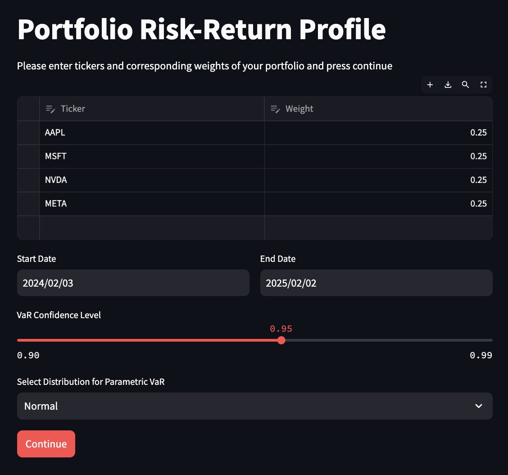
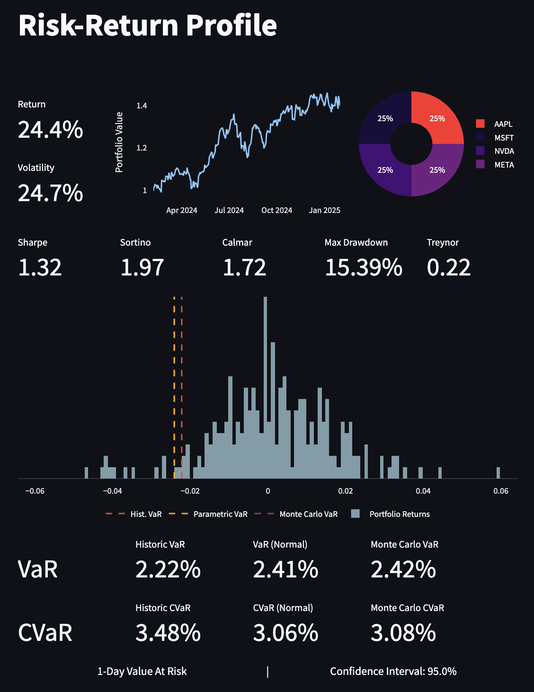

# PortRisk

A [**Streamlit**](https://portrisk.streamlit.app/)  web application that allows users to input their portfolio interactively and analyzes its risk-return characteristics, providing insights into performance metrics.

### **1. Portfolio Input Interface:**
- **Asset Selection**: Users can choose the assets in their portfolio by selecting from a list of supported tickers.
- **Asset Weights**: The app allows the user to specify the proportion of each asset in the portfolio.
- **Time Period**: Users can select a time range for performance analysis.
- **Confidence Level & Distribution**: The app allows users to set a confidence level and distribution for Value at Risk calculations.

### **2. Risk-Return Metrics:**
The app calculates several crucial performance and risk metrics, including:
- **Annualized Return**: The geometric average return of the portfolio over a selected time period.
- **Annualized Volatility**: Measures the extent of variability in returns over the time period, indicating risk.
- **Sharpe Ratio**: A risk-adjusted return measure, calculated by subtracting the risk-free rate from the portfolio return and dividing by the portfolio’s standard deviation.
- **Sortino Ratio**: Similar to the Sharpe ratio but focuses only on downside volatility (negative returns).
- **Calmar Ratio**: The ratio of the annualized return to the maximum drawdown, which assesses the return relative to the largest drop in value from peak to trough.
- **Maximum Drawdown (MDD)**: The maximum peak-to-trough decline in portfolio value during the selected time period, which helps assess the risk of significant losses.
- **Treynor Ratio**: A risk-adjusted performance measure that accounts for systematic risk (beta) rather than total volatility.
- **VaR and CVaR Calculations** The app supports three different methods to calculate Value at Risk (VaR) and Conditional Value at Risk (CVaR):
  - Parametric VaR and CVaR: Based on assumptions of a normal distribution of returns.
  - Historical VaR and CVaR: Using historical returns data to estimate potential future risks.
  - Monte Carlo Simulation VaR and CVaR: Through simulation-based random sampling to model a range of possible outcomes and risks.

To get started and use the PortRisk App, please visit [this Streamlit app](https://portrisk.streamlit.app/)!

